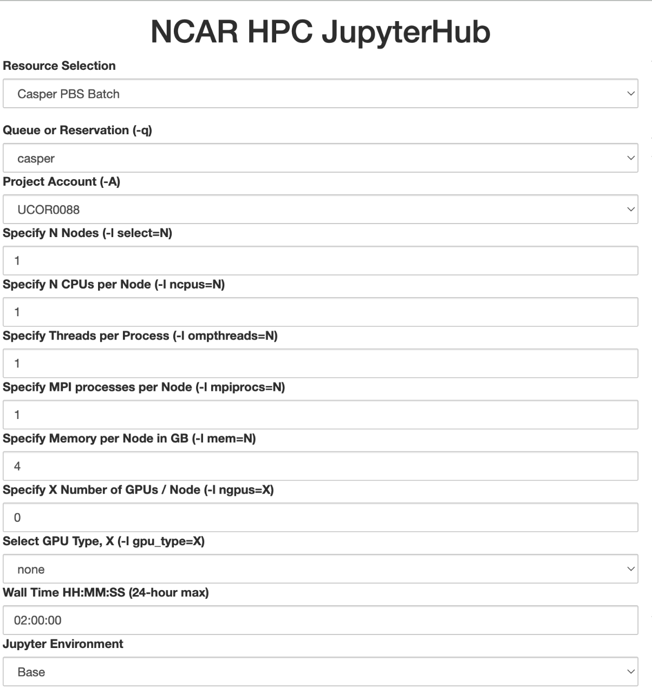
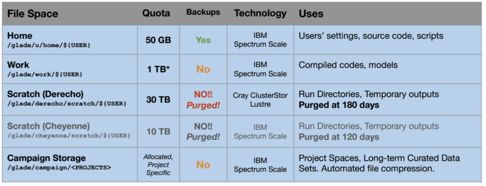

# NCAR HPC Systems User Guide

## Table of Contents
- [NCAR HPC Systems User Guide](#ncar-hpc-systems-user-guide)
  - [Table of Contents](#table-of-contents)
  - [Getting Started: Logging Into NCAR HPC Systems](#getting-started-logging-into-ncar-hpc-systems)
    - [SSH Login](#ssh-login)
  - [Submitting Jobs](#submitting-jobs)
    - [Creating a PBS Script](#creating-a-pbs-script)
  - [Using NCAR HPC Jupyter Hub](#using-ncar-hpc-jupyter-hub)
  - [Creating and Managing Conda Environments](#creating-and-managing-conda-environments)
  - [File Transfers](#file-transfers)
    - [Globus (Recommended for Large Files)](#globus-recommended-for-large-files)
    - [SCP/SFTP (Quick Manual Transfers)](#scpsftp-quick-manual-transfers)
    - [rsync (Smart Synchronization)](#rsync-smart-synchronization)
    - [BBCP (For Very Large Files)](#bbcp-for-very-large-files)
    - [Note on Storage](#note-on-storage)
  - [Working with Git Repositories](#working-with-git-repositories)
    - [Cloning a Repository](#cloning-a-repository)
    - [Basic Git Commands](#basic-git-commands)
  - [Additional Resources](#additional-resources)

## Getting Started: Logging Into NCAR HPC Systems

### SSH Login
Open a terminal (PowerShell, Linux shell, or macOS Terminal) and use the following command:

```bash
ssh your_username@derecho.hpc.ucar.edu
ssh your_username@casper.hpc.ucar.edu
```

Replace `your_username` with your assigned NCAR username (*yifanl*).

Note: Both systems share the GLADE file system, so your files are accessible from both environments.

## Submitting Jobs

NCAR HPC systems use PBS (Portable Batch System) for job scheduling. Here's how to submit jobs:

### Creating a PBS Script
Create a file named `job.pbs` with the following content:

```bash
#!/bin/bash
#PBS -N JobName
#PBS -l select=1:ncpus=1:mem=4GB
#PBS -l walltime=00:30:00
#PBS -l gpu_type=v100
#PBS -j oe
#PBS -q regular
#PBS -A your_project_code

# Load necessary modules
module load python

# Change to the directory where you submitted the job
cd $PBS_O_WORKDIR

# Run your script
python my_script.py
```

Explanation of PBS directives:
- `-N JobName`: Names your job
- `-l select=1:ncpus=1:mem=4GB`: Requests 1 node with 1 CPU and 4GB memory
- `-l walltime=00:30:00`: Requests 30 minutes of runtime
- `-j oe`: Joins output and error logs
- `-q regular`: Specifies the queue
- `-A your_project_code`: Specifies the project account to charge (*UCOR0090*)

Submit your job with:

```bash
qsub job.pbs
```

Check job status:

```bash
qstat -u $USER
qstat -f <job_id>
qstat -x -u $USER
```

Check jobs on other cluster:

```bash
qstat -u $USER @derecho
qstat -u $USER @casper
```

Check allocation usage:

```bash
ncar_accounting_report
```

Cancel a job with:

```bash
qdel job_id
```

## Using NCAR HPC Jupyter Hub

NCAR provides a Jupyter Hub for interactive computing:

1. Navigate to https://jupyterhub.hpc.ucar.edu
2. Log in with your NCAR credentials
3. Choose a computational resource (Derecho or Casper)
4. Select memory, cores, and time requirements

5. Launch a new notebook or terminal

Loading Conda environments in Jupyter:

```python
import sys
!module load conda
!conda activate your_environment
sys.path.append('/path/to/your/modules')
```

## Creating and Managing Conda Environments

To load the conda module:

```bash
module load conda
```

Create an environment:

```bash
mamba create -n my_ml_env python=3.10 numpy scipy pandas matplotlib
```

Activate environment:

```bash
conda activate my_ml_env
```

Install packages:

```bash
mamba install tensorflow pytorch scikit-learn
```

Use the conda environment in a PBS script:

```bash
module load conda
conda activate my_ml_env
python train_model.py
```

For Jupyter use:

```bash
mamba install ipykernel
```

## File Transfers

### Globus (Recommended for Large Files)

CISL recommends Globus for transferring large datasets or many files. Globus is a reliable transfer service with a web interface and high performance. It supports:

- Parallel file transfers
- Checkpoint/restart
- Transfers between systems like NCAR GLADE and your institution

To use Globus:

1. Visit [https://app.globus.org](https://app.globus.org)
2. Log in using your institution or NCAR credentials
3. Set up Globus Connect Personal if transferring from your laptop
4. Use the “NCAR GLADE” endpoint for HPC storage

### SCP/SFTP (Quick Manual Transfers)

For smaller or infrequent transfers, use `scp` or `sftp` via command line or GUI clients.

Upload a file:

```bash
scp local_file username@derecho.hpc.ucar.edu:/path/to/hpc/folder
```

Download a file:

```bash
scp username@derecho.hpc.ucar.edu:/path/to/hpc/folder local_file
```

GUI alternatives:
- WinSCP (Windows)
- FileZilla (Cross-platform)

### rsync (Smart Synchronization)

Use `rsync` when syncing folders or copying only changed files.

```bash
rsync -av -e ssh source_dir/ username@casper.hpc.ucar.edu:/glade/scratch/username/destination_dir/
```

Efficient for incremental updates or backing up folders.

### BBCP (For Very Large Files)

BBCP is a multi-stream copy tool provided by NCAR for high-throughput transfers.

It can split files into chunks and use multiple streams, outperforming `scp`.

### Note on Storage

Derecho and Casper share the GLADE file system, including `/glade/work`, `/glade/scratch`, and `/glade/campaign`.


So:
- You don’t need to copy files between Casper and Derecho.
- You can stage large datasets on `/glade/scratch` via Casper and run Derecho jobs that use them directly.


## Working with Git Repositories

### Cloning a Repository

```bash
git clone https://github.com/your_username/your_repo.git
```

### Basic Git Commands

```bash
# Check status
git status

# Add changes
git add .

# Commit changes
git commit -m "Your commit message"

# Push changes
git push origin main
```

## Additional Resources
- NCAR HPC System Status: https://arc.ucar.edu/system_status
- NCAR HPC Systems Accounting Manager: https://sam.ucar.edu/app/home
- NCAR Research Computing (RC) Helpdesk: https://ithelp.ucar.edu/plugins/servlet/desk/site/rc
- NCAR HPC Documentation: https://ncar-hpc-docs.readthedocs.io/en/latest, https://arc.ucar.edu/docs
- NCAR HPC Tutorials: https://www2.cisl.ucar.edu/what-we-do/training-library/hpc-tutorials
- NCAR HPC Research Computing Support: https://ncar-hpc-docs.readthedocs.io/en/latest/user-support/#virtual-consulting
- Using Conda: https://ncar-hpc-docs.readthedocs.io/en/stable/environment-and-software/user-environment/conda
- PBS User Guide: https://ncar-hpc-docs.readthedocs.io/en/latest/pbs/job-scripts
- Module System Guide: https://ncar-hpc-docs.readthedocs.io/en/latest/environment-and-software/user-environment/modules
- NCAR Globus Documentation: https://ncar-hpc-docs.readthedocs.io/en/latest/storage-systems/data-transfer/globus
